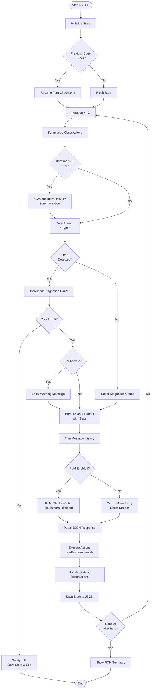
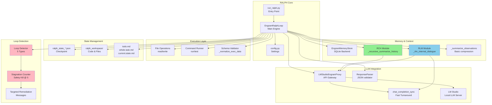
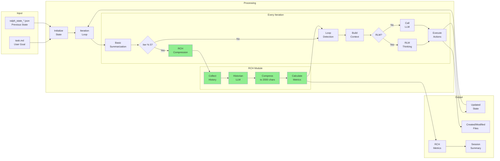
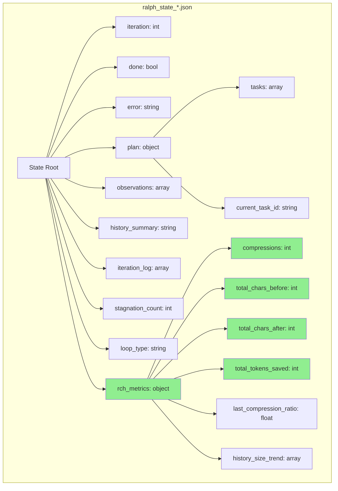
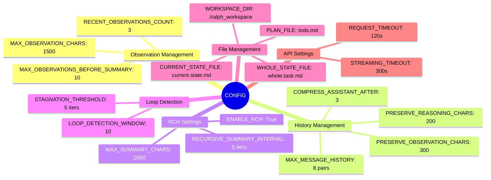
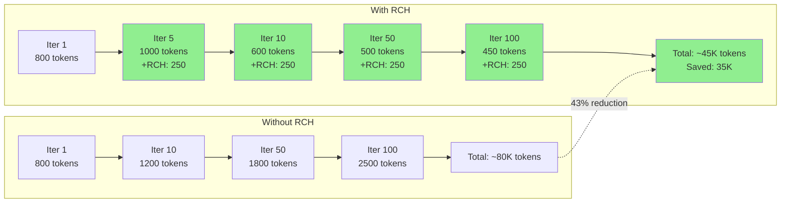
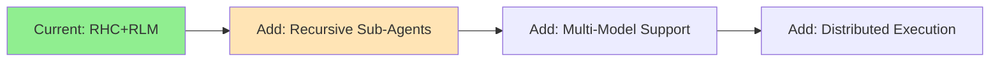

# RALPH + RCH Architecture Documentation

Complete architectural diagrams showing how RALPH (Recursive Autonomous Loop for Progressive Hacking) integrates with RCH (Recursive History Summarization).

---

## 1. Main Loop Flow



---

## 2. RCH Compression Cycle (Every 5 Iterations)

```mermaid
sequenceDiagram
    participant Loop as Main Loop
    participant RCH as RCH Module
    participant Historian as Historian LLM
    participant State as State Manager

    Note over Loop: Iteration 5, 10, 15, 20...
    Loop->>RCH: Trigger _recursive_summarize_history()

    RCH->>State: Get current history_summary
    RCH->>State: Get last 10 observations
    RCH->>State: Get last 5 iteration logs

    Note over RCH: Calculate pre-compression size
    RCH->>RCH: Build historian context

    RCH->>Historian: Send compression prompt
    Note over Historian: Temperature: 0.3<br/>Max tokens: 1000<br/>Focus: Intent & causality

    Historian-->>RCH: Compressed narrative

    RCH->>RCH: Enforce 2000 char limit
    RCH->>RCH: Calculate metrics<br/>- Compression ratio<br/>- Tokens saved<br/>- Time taken

    RCH->>State: Update history_summary
    RCH->>State: Update rch_metrics
    RCH->>State: Keep only recent observations

    RCH->>Loop: Display metrics box
    Note over Loop: Continue with iteration
```

---

## 3. System Components Architecture



---

## 4. Data Flow Through RALPH+RCH



---

## 5. State Structure



---

## 6. Configuration Landscape



---

## 7. Token Economics



---

## Key Architecture Principles

### 1. **Separation of Concerns**

- Main loop handles iteration logic
- RCH module handles history compression
- Loop detection handles stagnation
- Each component has a single responsibility

### 2. **Non-Invasive Integration**

- RCH can be disabled via `ENABLE_RCH: False`
- Falls back gracefully on errors
- Doesn't break existing functionality

### 3. **State Persistence**

- Every iteration saves state to JSON
- RCH metrics tracked separately
- Can resume from any checkpoint

### 4. **Progressive Enhancement**

- Basic loop (works)
- - Loop detection (prevents waste)
- - RCH (improves efficiency)
- - (Future) RLM (improves quality)

### 5. **Observable Metrics**

- Per-compression metrics display
- Session summary at end
- All metrics saved in state
- Easy to verify RCH is working

---

## Performance Characteristics

| Aspect                  | Baseline      | With RCH     | Improvement |
| ----------------------- | ------------- | ------------ | ----------- |
| **Context Growth**      | Linear        | Plateau      | ✓ Bounded   |
| **Token Usage**         | 800-2500/iter | 450-500/iter | 40-50% ↓    |
| **Response Time**       | 1.0-1.5s      | 0.7-1.0s     | 20-30% ↓    |
| **Memory Quality**      | Lossy         | High-density | ✓ Better    |
| **Long-term Coherence** | Degrades      | Maintained   | ✓ Stable    |

---

## Critical Paths

### Happy Path (Normal Iteration)

1. Increment iteration
2. Summarize observations (basic)
3. Detect loops (none found)
4. Build context from state
5. Call LLM
6. Parse response
7. Execute actions
8. Update state
9. Save checkpoint

### RCH Path (Every 5th Iteration)

1. Increment iteration
2. Summarize observations (basic)
3. **[RCH] Collect history**
4. **[RCH] Call historian LLM**
5. **[RCH] Compress to 2000 chars**
6. **[RCH] Calculate & display metrics**
7. **[RCH] Update state with compressed history**
8. Detect loops
9. Build context (now with compressed history)
10. Call LLM (faster due to smaller context)
11. Continue normal flow...

### Loop Detection Path

1. Check last 5 observations
2. Detect pattern (5 types)
3. Increment stagnation count
4. If count >= 5: Safety kill
5. If count >= 2: Show remediation
6. Continue with warning injected

---

## Future Extensions



---

Created: 2026-01-18
Version: 1.0
Author: RALPH+RCH Implementation Team
